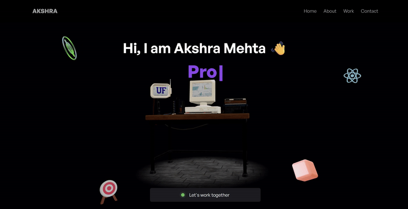

# 🌐 Akshra Portfolio

Welcome to my personal interactive 3D developer portfolio website — built with **Three.js**, **React**, and modern web technologies. This project showcases my skills, projects, and personality in an engaging and creative format.

## 🖼️ Preview

## 🚀 Features

- ✨ 3D Developer Avatar with animations (idle, salute, victory, etc.)
- 🌙 Dark theme UI with smooth transitions
- 📱 Responsive and optimized for all screen sizes
- 📁 Organized project sections for About, Work, Contact
- 🎨 Custom shader backgrounds and particle effects
- 💬 Contact form functionality

## 🛠️ Built With

- [React.js](https://reactjs.org/)
- [Three.js](https://threejs.org/)
- [@react-three/fiber](https://docs.pmnd.rs/react-three-fiber)
- [@react-three/drei](https://github.com/pmndrs/drei)
- [Tailwind CSS](https://tailwindcss.com/)
- [Framer Motion](https://www.framer.com/motion/)
- [Blender](https://www.blender.org/) (for 3D model editing)
- [Vite](https://vitejs.dev/) (for fast development)

## 📦 Getting Started

### 🔧 Prerequisites
- Node.js (v16+ recommended)
- npm or yarn

### 🧪 Installation

### Clone the repository
git clone https://github.com/akshara01/Akshra-Portfolio.git

### Navigate into the project
cd Akshra-Portfolio

### Install dependencies
npm install

### Start the development server
npm run dev

Visit http://localhost:5173 in your browser.
